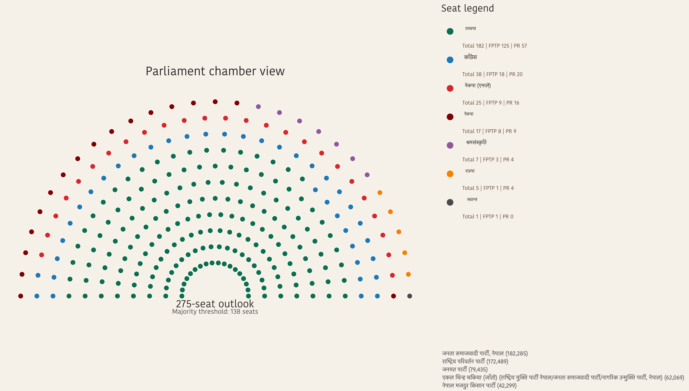
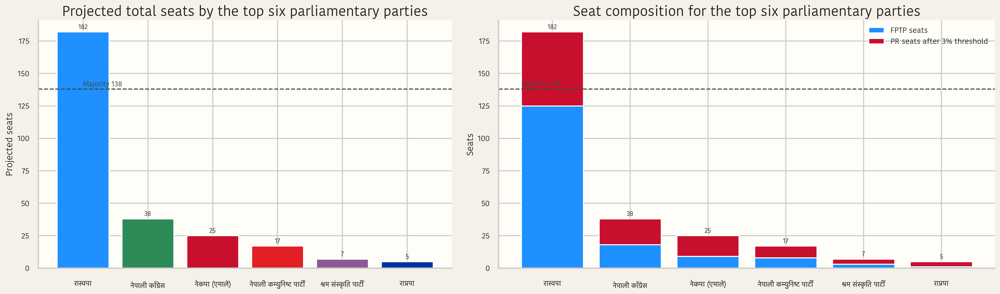
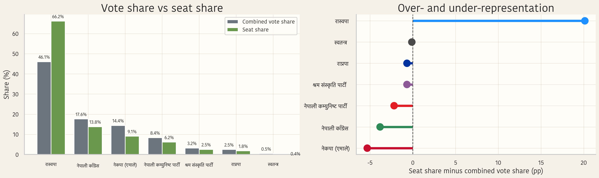
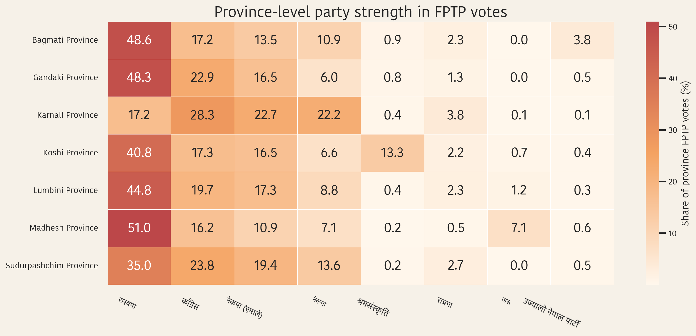
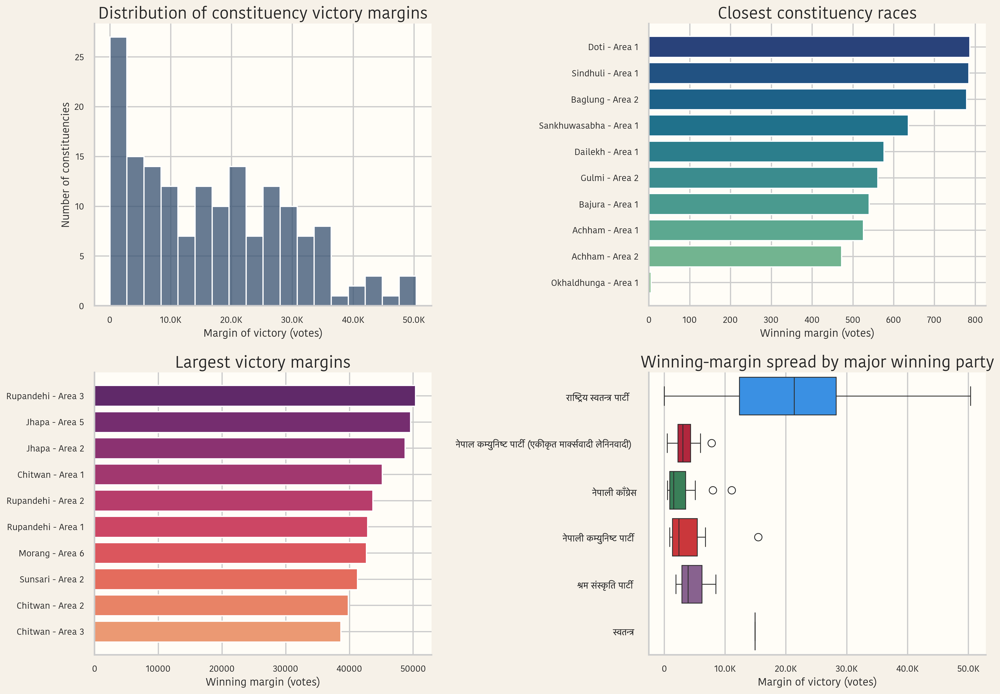
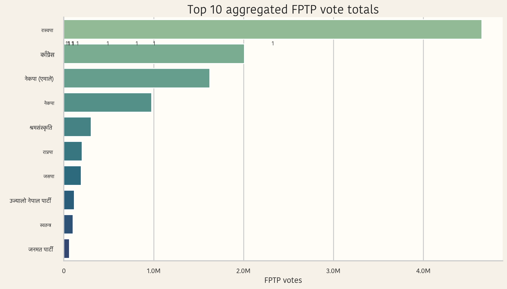
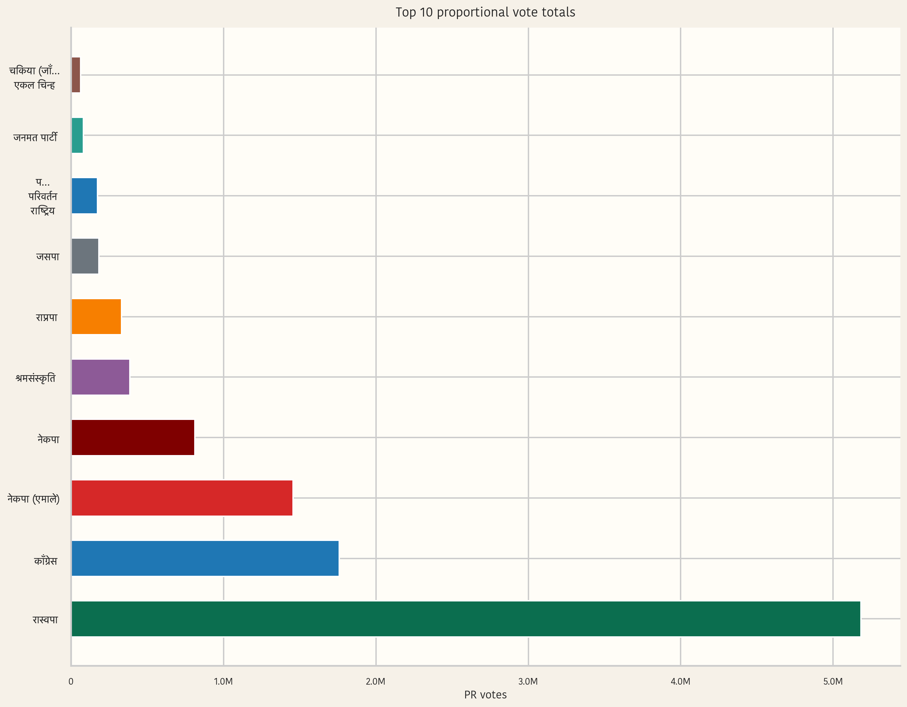

# Nepal Election 2082 Data Analysis

<p align="center">
  
</p>

<p align="center">
  A repository for exploring, cleaning, exporting, and presenting Nepal Election 2082 data across notebooks, static visuals, JSON/CSV exports, a standalone HTML report, and a Next.js storytelling site.
</p>

<p align="center">
  
  
  
  
</p>

## Table of Contents

- [Nepal Election 2082 Data Analysis](#nepal-election-2082-data-analysis)
  - [Table of Contents](#table-of-contents)
  - [Overview](#overview)
  - [What's Included](#whats-included)
  - [Visual Gallery](#visual-gallery)
  - [Repository Structure](#repository-structure)
  - [Data Files](#data-files)
    - [Primary inputs](#primary-inputs)
    - [Exported datasets](#exported-datasets)
  - [How to Use This Repository](#how-to-use-this-repository)
    - [1. Explore the static report](#1-explore-the-static-report)
    - [2. Work with the notebooks](#2-work-with-the-notebooks)
    - [3. Reuse exported data](#3-reuse-exported-data)
    - [4. Reuse generated figures](#4-reuse-generated-figures)
  - [Website Sample](#website-sample)
    - [Run locally](#run-locally)
    - [App data sources](#app-data-sources)
  - [Analysis Workflow](#analysis-workflow)
  - [Highlights](#highlights)

## Overview

This repository brings together several layers of election work in one place:

- raw and prepared election files
- Jupyter notebooks for data preparation and comparison analysis
- exported datasets in CSV and JSON formats
- generated PNG charts and analytical visuals
- a polished single-file `index.html` summary page
- a richer `website sample` Next.js app for interactive storytelling

The content centers on Nepal Election 2082, with emphasis on:

- first-past-the-post and proportional vote analysis
- vote share, seat share, and margin comparisons
- province-level and party-level patterns
- presentation-ready charts and summaries

## What's Included

| Area | Purpose |
| --- | --- |
| `Assets/` | Spreadsheet of the winners of the election |
| `Codes/` | Jupyter notebooks for cleaning, transforming, and comparing election data |
| `Exports/` | Result of web scraped data with full details of the election results along with other reusable CSV and JSON outputs for downstream analysis and visualization |
| `Images/` | Rendered charts, seat maps, and key-facts graphics |
| `index.html` | Standalone presentation page for a quick visual summary |
| `website sample/` | Next.js app version with section-based storytelling and reusable UI components |

## Visual Gallery

<table>
  <tr>
    <td width="50%">
      
    </td>
    <td width="50%">
      
    </td>
  </tr>
  <tr>
    <td width="50%">
      
    </td>
    <td width="50%">
      
    </td>
  </tr>
  <tr>
    <td width="50%">
      
    </td>
    <td width="50%">
      
    </td>
  </tr>
</table>

Additional charts are available in [`Images/`](./Images).

## Repository Structure

```text
Election82_data_analysis/
├── Assets/
│   └── Winners_Nepal_election_2082.xlsx
├── Codes/
│   ├── data_prep.ipynb
│   ├── data_prep_ec.ipynb
│   ├── proportional.ipynb
│   └── vote_type_comparison.ipynb
├── Exports/
│   ├── nepal_election_2082_results.csv
│   ├── nepal_election_2082_results.json
│   ├── nepal_election_2082_results_ec.csv
│   ├── nepal_election_2082_results_ec.json
│   ├── proportional_votes.csv
│   └── proportional_votes.json
├── Images/
│   ├── key_facts_top_closest_races.png
│   ├── key_facts_top_fptp_votes.png
│   ├── key_facts_top_pr_votes.png
│   ├── key_facts_top_victory_margins.png
│   ├── key_facts_top_vote_efficiency.png
│   ├── parliament_companion_charts.png
│   ├── parliament_seatmap.png
│   ├── vote_type_alignment_coverage.png
│   ├── vote_type_fptp_and_combined_seat_composition.png
│   ├── vote_type_overall_grouped_vote_shares.png
│   ├── vote_type_overall_grouped_votes.png
│   ├── vote_type_province_heatmap.png
│   ├── vote_type_scatter_relationship.png
│   ├── vote_type_selected_exact_shares_and_gaps.png
│   ├── vote_type_selected_exact_votes.png
│   ├── vote_type_structural_ratio.png
│   ├── vote_type_victory_margin_analysis.png
│   ├── vote_type_vote_efficiency.png
│   └── vote_type_vote_share_vs_seat_share.png
├── website sample/
│   ├── app/
│   ├── components/
│   ├── data/
│   ├── hooks/
│   ├── lib/
│   ├── public/
│   ├── styles/
│   └── package.json
├── index.html
└── settings.local.json
```

## Data Files

### Primary inputs

- [`Assets/Winners_Nepal_election_2082.xlsx`](./Assets/Winners_Nepal_election_2082.xlsx): spreadsheet source used for winner-level election work

### Exported datasets

- [`Exports/nepal_election_2082_results.csv`](./Exports/nepal_election_2082_results.csv): processed election results in CSV form
- [`Exports/nepal_election_2082_results.json`](./Exports/nepal_election_2082_results.json): processed election results in JSON form
- [`Exports/nepal_election_2082_results_ec.csv`](./Exports/nepal_election_2082_results_ec.csv): alternate export prepared from EC-focused processing
- [`Exports/nepal_election_2082_results_ec.json`](./Exports/nepal_election_2082_results_ec.json): JSON counterpart of the EC-focused export
- [`Exports/proportional_votes.csv`](./Exports/proportional_votes.csv): proportional vote data in CSV form
- [`Exports/proportional_votes.json`](./Exports/proportional_votes.json): proportional vote data in JSON form

## How to Use This Repository

### 1. Explore the static report

Open [`index.html`](./index.html) directly in a browser to view the standalone one-page summary.

### 2. Work with the notebooks

Open the notebooks in [`Codes/`](./Codes) with Jupyter Notebook, JupyterLab, or VS Code:

- [`data_prep.ipynb`](./Codes/data_prep.ipynb)
- [`data_prep_ec.ipynb`](./Codes/data_prep_ec.ipynb)
- [`proportional.ipynb`](./Codes/proportional.ipynb)
- [`vote_type_comparison.ipynb`](./Codes/vote_type_comparison.ipynb)

### 3. Reuse exported data

If you only need the processed outputs for dashboards or secondary analysis, start from [`Exports/`](./Exports) instead of rerunning the notebooks.

### 4. Reuse generated figures

The chart images under [`Images/`](./Images) are ready to embed into reports, slides, or documentation.

## Website Sample

The `website sample/` directory contains a Next.js app that turns the analysis into a more narrative, section-based experience with:

- hero statistics and election overview
- timeline storytelling
- seat distribution and comparison sections
- turnout and key moment summaries
- winner profiles and implications

### Run locally

```bash
cd "website sample"
npm install
npm run dev
```

Then open `http://localhost:3000`.

### App data sources

The app is powered by JSON files in [`website sample/data/`](./website%20sample/data), including:

- `overview.json`
- `seats.json`
- `comparison.json`
- `timeline.json`
- `turnout.json`
- `moments.json`
- `winners.json`
- `votes.json`

## Analysis Workflow

```text
Spreadsheet / raw election inputs
        ->
Jupyter notebooks in Codes/
        ->
CSV and JSON outputs in Exports/
        ->
PNG visualizations in Images/
        ->
Presentation layers:
  - index.html
  - website sample/
```

## Highlights

- Multiple delivery formats: notebook, dataset, image, static HTML, and Next.js app.
- Presentation-ready visuals already generated in `Images/`.
- Processed exports available in both CSV and JSON.
- Clean separation between analysis artifacts and frontend presentation.
